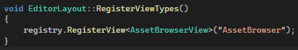

# Editor Views
Editor views are tools within the game engine such as an asset browser, game view or console, they can be opened and closed manually.

## Registering Views

After you register them, they will automaticly appear in the engines main menu bar, under the "Views" category.